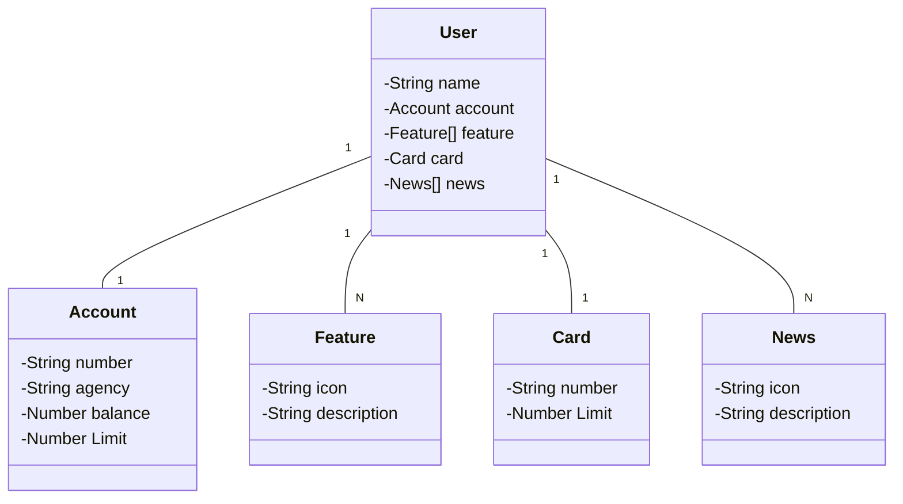

# Projeto API RESTful
Java RESTful API criada para o projeto do bootcamp da dio

## Diagrama de Classes

```mermaid
classDiagram

 class User {
   -String name
   -Account account
   -Feature[] feature
   -Card card
   -News[] news
}

 class Account {
   -String number
   -String agency
   -Number balance
   -Number Limit
 }

 class Feature {
   -String icon
   -String description
 }

 class Card {
   -String number
   -Number Limit
 }

 class News {
   -String icon
   -String description
 }

 User "1" -- "1" Account
 User "1" -- "N" Feature
 User "1" -- "1" Card
 User "1" -- "N" News
```
